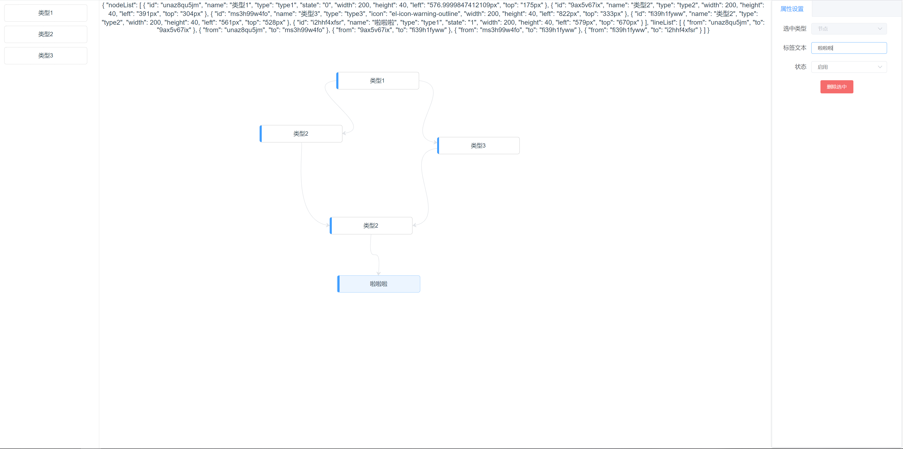

# jsplumb-flow-temp

> jsplumb 拖拉拽流程图的模板，可直接进行二次开发



## 数据结构

- 节点基础结构

```json
{
  "id": "unaz8qu5jm",
  "name": "类型1",
  "type": "type1",
  "left": "576px",
  "top": "175px"
}
```

- 线结构

```json
{ "from": "9ax5v67ix", "to": "fi39h1fyww" }
```

- 节点扩充属性配置

```js
// menu-list.js
// 节点菜单属性配置
export default [
  {
    id: 1,
    name: "类型1",
    type: "type1",
    attrs: [
      {
        name: "name",
        title: "标签文本",
        default: "标签",
        type: "text"
      },
      {
        name: "state",
        title: "状态",
        default: "0",
        type: "select",
        option: [
          {
            value: "0",
            label: "禁用"
          },
          {
            value: "1",
            label: "启用"
          }
        ]
      }
    ]
  },
  {
    id: 2,
    name: "类型2",
    type: "type2",
    attrs: [
      {
        name: "name",
        title: "标签文本",
        default: "标签",
        type: "text"
      }
    ]
  },
  {
    id: 3,
    name: "类型3",
    type: "type3",
    attrs: [
      {
        name: "name",
        title: "标签文本",
        default: "标签",
        type: "text"
      },
      {
        name: "icon",
        title: "图标",
        default: "el-icon-warning-outline",
        type: "text"
      }
    ]
  }
];
```
